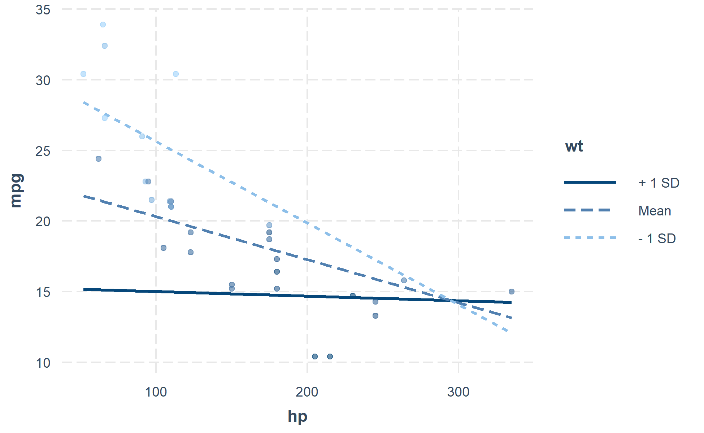
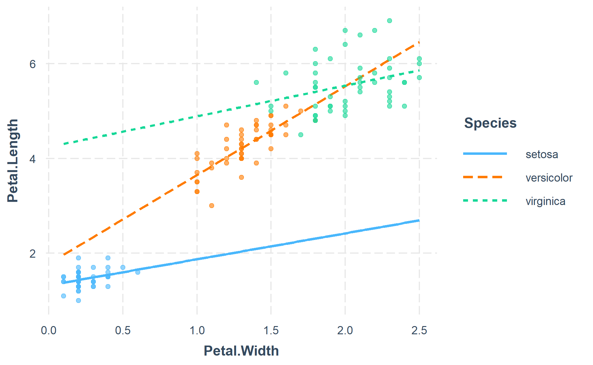

<!-- README.md is generated from README.Rmd. Please edit that file -->

# interactions 

<!-- badges: start -->

[](https://cran.r-project.org/package=interactions)
[](https://github.com/jacob-long/interactions)
[](https://cran.r-project.org/package=interactions)
[](https://github.com/jacob-long/interactions/actions/workflows/R-CMD-check.yaml)
[](https://ci.appveyor.com/project/jacob-long/interactions)
[](https://app.codecov.io/gh/jacob-long/interactions)
[](https://www.repostatus.org/#active)
[](https://opensource.org/licenses/MIT)
<!-- badges: end -->

This package consists of a number of tools for the analysis and
interpretation of statistical interactions in regression models. Some of
these features, especially those that pertain to visualization, are not
highly labor-intensive to do oneself but are tedious and error-prone
when done “by hand.”

Quick rundown of features:

- simple slopes analysis
- calculation of Johnson-Neyman intervals
- visualization of predicted and observed values using `ggplot2`

All of these are implemented in a consistent interface designed to be as
simple as possible with tweaks and guts available to advanced users.
GLMs, models from the `survey` package, and multilevel models from
`lme4` are fully supported as is visualization for Bayesian models from
`rstanaram` and `brms`. Several other model types work “out of the box”
even though they are not officially supported.

## Installation

The package is available via CRAN.

``` r
install.packages("interactions")
```

## Usage

Unless you have a keen eye and good familiarity with both the underlying
mathematics and the scale of your variables, it can be very difficult to
look at the output of regression model that includes an interaction and
completely understand what the model is telling you.

This package contains several means of aiding the understanding of and
doing statistical inference with interactions.

### Johnson-Neyman intervals and simple slopes analysis

The “classic” way of probing an interaction effect is to calculate the
slope of the focal predictor at different values of the moderator. When
the moderator is categorical, this is especially informative—e.g., what
is the slope for cats vs. dogs? But you can also arbitrarily choose
points for continuous moderators.

With that said, the more statistically rigorous way to explore these
effects is to find the Johnson-Neyman interval, which tells you the
range of values of the moderator in which the slope of the predictor is
significant vs.  nonsignificant at a specified alpha level.

The `sim_slopes` function will by default find the Johnson-Neyman
interval and tell you the predictor’s slope at specified values of the
moderator; by default either both values of binary predictors or the
mean and the mean +/- one standard deviation for continuous moderators.

``` r
library(interactions)
fiti <- lm(mpg ~ hp * wt, data = mtcars)
sim_slopes(fiti, pred = hp, modx = wt, jnplot = TRUE)
```

    #> JOHNSON-NEYMAN INTERVAL
    #> 
    #> When wt is OUTSIDE the interval [3.69, 5.90], the slope of hp is p < .05.
    #> 
    #> Note: The range of observed values of wt is [1.51, 5.42]

<!-- -->

    #> SIMPLE SLOPES ANALYSIS
    #> 
    #> Slope of hp when wt = 2.238793 (- 1 SD): 
    #> 
    #>    Est.   S.E.   t val.      p
    #> ------- ------ -------- ------
    #>   -0.06   0.01    -5.66   0.00
    #> 
    #> Slope of hp when wt = 3.217250 (Mean): 
    #> 
    #>    Est.   S.E.   t val.      p
    #> ------- ------ -------- ------
    #>   -0.03   0.01    -4.07   0.00
    #> 
    #> Slope of hp when wt = 4.195707 (+ 1 SD): 
    #> 
    #>    Est.   S.E.   t val.      p
    #> ------- ------ -------- ------
    #>   -0.00   0.01    -0.31   0.76

The Johnson-Neyman plot can help you get a handle on what the interval
is telling you, too. Note that you can look at the Johnson-Neyman
interval directly with the `johnson_neyman()` function.

The above all generalize to three-way interactions, too, although
Johnson-Neyman intervals do not handle the second moderator in the way
that they do the first.

### Visualizing interaction effects

This function plots two- and three-way interactions using `ggplot2` with
a similar interface to the aforementioned `sim_slopes` function. Users
can customize the appearance with familiar `ggplot2` commands. It
supports several customizations, like confidence intervals.

``` r
interact_plot(fiti, pred = hp, modx = wt, interval = TRUE)
```

<!-- -->

You can also plot the observed data for comparison:

``` r
interact_plot(fiti, pred = hp, modx = wt, plot.points = TRUE)
```

<!-- -->

The function also supports categorical moderators—plotting observed data
in these cases can reveal striking patterns.

``` r
fitiris <- lm(Petal.Length ~ Petal.Width * Species, data = iris)
interact_plot(fitiris, pred = Petal.Width, modx = Species, plot.points = TRUE)
```

<!-- -->

You may also combine the plotting and simple slopes functions by using
`probe_interaction`, which calls both functions simultaneously.
Categorical by categorical interactions can be investigated using the
`cat_plot()` function.

## Contributing

I’m happy to receive bug reports, suggestions, questions, and (most of
all) contributions to fix problems and add features. I prefer you use
the Github issues system over trying to reach out to me in other ways.
Pull requests for contributions are encouraged.

Please note that this project is released with a [Contributor Code of
Conduct](https://github.com/jacob-long/interactions/blob/master/CONDUCT.md).
By participating in this project you agree to abide by its terms.

## License

The source code of this package is licensed under the [MIT
License](https://opensource.org/licenses/mit-license.php).
